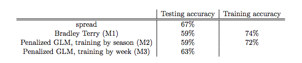
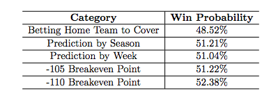
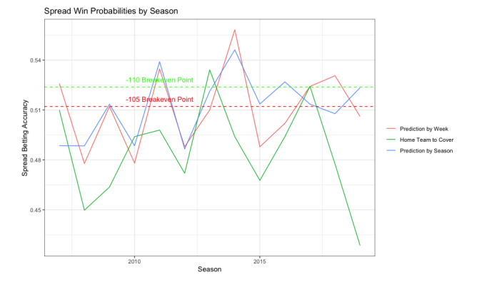

# Welcome to our stat992project repo!
This is the website containing all materials for the STAT 992 final project from the NFL game prediction team (Elina Choi, Shan Lu, and Steven Moen).
- The final report is stat992_project_report.pdf
- The code for the analysis is code.R
- The data are in the files game.csv and spread_to_odds.csv

# Summary of Work

- Using NFL regular season game data from the 2006 through 2019 seasons, we fit different models to predict NFL game results 
- For predicting wins or losses, a penalized generalized linear model updated with data every week performs the best among the candidate models
- For predicting the margin of victory, a penalized linear model updated by season performs the best, though not quite good enough to turn a profit 

# Models used

- The Bradley-Terry model to predict the binary outcome variable of a pairwise comparison between teams (which is winning in this context) using the prior season's data as a training set 
- Next, we added an L2 penalty to a generalized linear model with a logit link function, and updated it in two separate ways
  - The first method updated the model every season, and the second updated the model every week
  - Interestingly, adding additional covariates to this model such as the weather or the difference in number of days of rest between the teams does not improve the accuracy of the win-loss prediction
- Next, a similar analysis was performed to predict the margin of victory using the same L2 penalty and using a Gaussian (identity) link function
  - The only covariates used other than the teams and home team advantage was the point spread, which is known before the game

# Key Tables and Charts

Figure 1: Model Classification Accuracy for Predicting Wins and Losses
line

Figure 2: Model Classification Accuracy for Predicting Margin of Victory
line

Figure 3: Predicting Margin of Victory by Season
line

